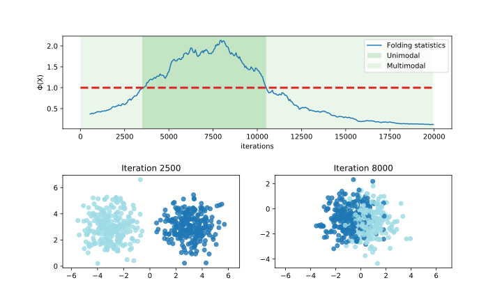

# python3-libfolding/pyfolding

Ths repository gathers python3 bindings to `libfolding`, a library performing the Folding Test of Unimodality (FTU) on both batch and streaming data.

For more details about `libfolding` and the FTU, visit https://asiffer.github.io/libfolding

## Installation

You can download it through `apt` (it will automatically download `libfolding`)
```shell
$ sudo add-apt-repository ppa:asiffer/libfolding
$ sudo apt-get update
$ sudo apt-get install python3-libfolding
```

Otherwise, it is also available on PyPI (but you must install `libfolding` independently)
```shell
$ pip3 install pyfolding
```

## Usage

### Batch

The first thing you probably want to do is to check is a dataset is unimodal. `pyfolding` embeds the `FTU` function which does the job. You can either choose 
the pure python implementation (`routine="python"`) or the wrapper around the `C++` native implementation (`routine="c++"`).

WARNING: The results of the two routines may be slightly different.

```python
import pyfolding as pf
import numpy as np

# 1D example
X = np.random.normal(0, 1, 2000)
results = pf.FTU(X, routine="python")
print(results)
```

The output may look like the following:
```shell
           #observations: 2000
                     dim: 1
                    Φ(X): 1.436777489
                    φ(X): 0.359194372
         folded variance: 0.343085433
           folding pivot: [-0.02638367]
                 p-value: 0.000065827
                    time: 0.000453949
                 message: 
```

The results gather quite everything about the test. The most important field is the folding statistics Φ(X). If it is greater than 1, the dataset is then unimodal, otherwise it is multimodal. We can tackle more complex datasets:

```python
import pyfolding as pf
from sklearn.datasets import make_blobs
import numpy as np

# 2D example (3000 points, dimension 3, 2 clusters)
X,_ = make_blobs(n_samples=3000, n_features=3, centers=2, random_state=42)
results = pf.FTU(X, routine="cpp")
print(results)
```

The output may look like as below. We can check that the folding statistic Φ(X) is lower than 1, so the distribution is multimodal.
```shell
           #observations: 3000
                     dim: 3
                    Φ(X): 0.157387899
                    φ(X): 0.009836744
         folded variance: 1.027833560
           folding pivot: [-0.31059918  1.08473035 -1.16174564]
                 p-value: 0.000000000
                    time: 0.000575000
                 message: 
```

### Streaming

One of the main feature of the FTU is the ability to be computed/updated over streaming data. In the example below, two gaussian clusters move towards each other and then move away. The FTU is then able to estimate the unimodality in live, on the current window.

```python
# streamfolding.py
import pyfolding as pf
import numpy as np
import matplotlib.pyplot as plt


def data_generator(n: int, speed: int = 1e-3, std: float = 1.0):
    mu0 = np.array([-5, 5])
    v0 = np.array([1, -1]) / np.sqrt(2)
    mu1 = np.array([5, 5])
    v1 = np.array([-1, -1]) / np.sqrt(2)
    X = np.random.multivariate_normal([0, 0], std * np.eye(2), n)
    y = np.zeros(n)
    e = np.random.uniform(-1, 1, n)
    for i in range(n):
        if e[i] > 0:
            y[i] = 1
            X[i] += mu0 + v0 * speed * i
        else:
            y[i] = -1
            X[i] += mu1 + v1 * speed * i
    return X, y


# create StreamFolding object with window size equal to 500
depth = 500
sf = pf.StreamFolding(depth)

# container to retrieve some data during the exp.
x_phi = []
phi = []

# data & labels
n_data = 20000
data, c = data_generator(n_data, speed=0.001)

# run
for i, x in enumerate(data):
    sf.update(x)
    if i > depth and i % 50 == 0:
        r = sf.folding_test()
        x_phi.append(i)
        phi.append(r.folding_statistics)

# plotting stuff
unimodal_indices = [i for i, k in enumerate(phi) if k > 1]

plt.figure(figsize=(10, 6))
plt.subplots_adjust(hspace=0.5)
ax1 = plt.subplot(2, 2, (1, 2))

ax1.plot(x_phi, phi, label="Folding statistics")
ax1.plot([0, n_data], [1, 1], ls='--', lw=3, color='tab:red')
ax1.axvspan(x_phi[unimodal_indices[0]], x_phi[unimodal_indices[-1]],
            facecolor='tab:green', alpha=0.2, label="Unimodal")
ax1.axvspan(0, x_phi[unimodal_indices[0]], facecolor='tab:green', alpha=0.1, label="Multimodal")
ax1.axvspan(x_phi[unimodal_indices[0]], x_phi[-1], facecolor='tab:green', alpha=0.1)
ax1.set_xlabel('iterations')
ax1.set_ylabel('Φ(X)')
ax1.legend()

it = 2500
ax2 = plt.subplot(2, 2, 3)
ax2.scatter(data[it:it + depth, 0],
            data[it:it + depth, 1],
            c=c[it:it + depth], alpha=0.8, cmap='tab20')
ax2.axis('equal')
ax2.set_title(f'Iteration {it}')

it = 8000
ax3 = plt.subplot(2, 2, 4)
ax3.scatter(data[it:it + depth, 0],
            data[it:it + depth, 1],
            c=c[it:it + depth], alpha=0.8, cmap='tab20')
ax3.axis('equal')
ax3.set_title(f'Iteration {it}')
```

You can run this code and check the output:
```shell
$ ipython3 -i streamfolding.py --matplotlib

```
